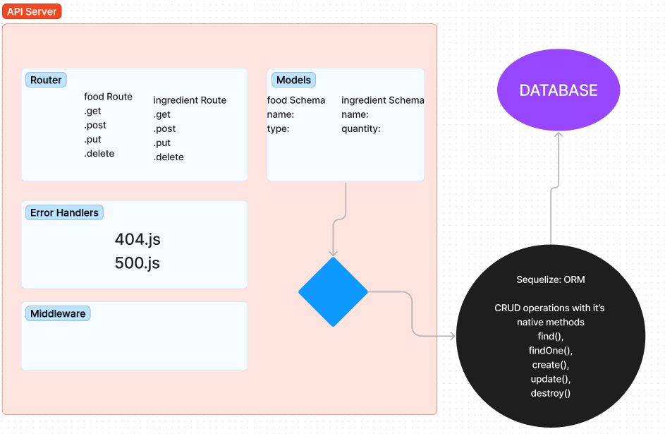
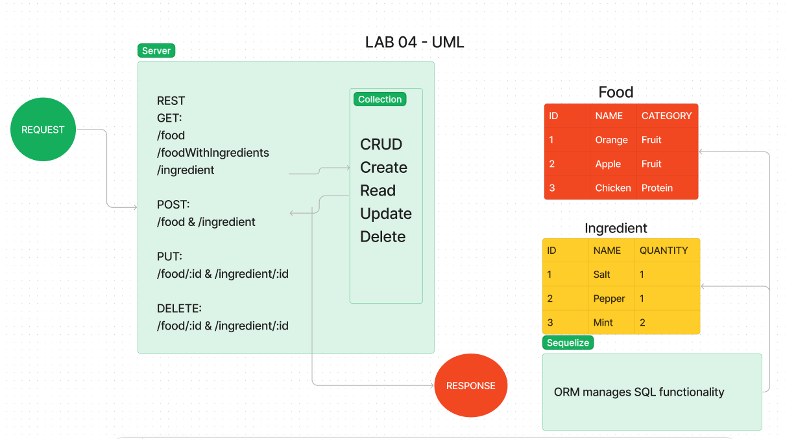

LAB - Class 03
Project: Express Rest API
Author: Reece Renninger

Problem Domain

- Create an Express API with full CRUD functionality. Utilize Sequelize library on top of all of the previous lab tools.

Links and Resources

  [GitHub Actions ci/cd](https://github.com/ReeceRenninger/api-server)

  [back-end server url](https://api-gress.onrender.com)

Collaborators

- Keelen, Tony, Miguel helped with the GET and PUT functionality.
- Ryan G and Ike helped with documentation and implementation of PUT for food route.
- Josh helped with error debugging in terminal.

- [My PR to Mike P Repo for Review](https://github.com/catdude2000/api-server/pull/2)
- Mike and I talked through my code and he suggested changes/ comments, ACP process was not working so we shared screen.

Setup

PORT env is setup, devs can set port to whatever they want

How to initialize/run your application (where applicable)

    clone repo to local machine, 
    npm init -y
    npm i jest, supertest, express, dotenv, sequelize, sqlite3, pg, sequelize-cli, cors, eslint
    You will need to have post gres set up locally to create your SQL db 
    create an index.js at root for access point
    spin up your psql or nodemon to check server status

How to use your library (where applicable)
Features / Routes

    GET : / - proof of life route

    GET : /food - grab all food entries
    GET : /food/:id - grab single food entry
    POST : /food - create a single food entry
    PUT : /food/:id - update a single food entry
    DELETE : /food/:id - delete a single food entry

    GET : /ingredients - grab all ingredient entries
    GET : /ingredients/:id - grab a single ingredient entry
    POST : /ingredient - create a single ingredient entry
    PUT : /ingredient/:id - update a single ingredient entry
    DELETE : / ingredients/:id - delete a single ingredient entry

Tests

    npm test (specific tests can be targeted)
    Any tests of note?
    Describe any tests that you did not complete, skipped, etc

UML

- lab 03

- lab 04

